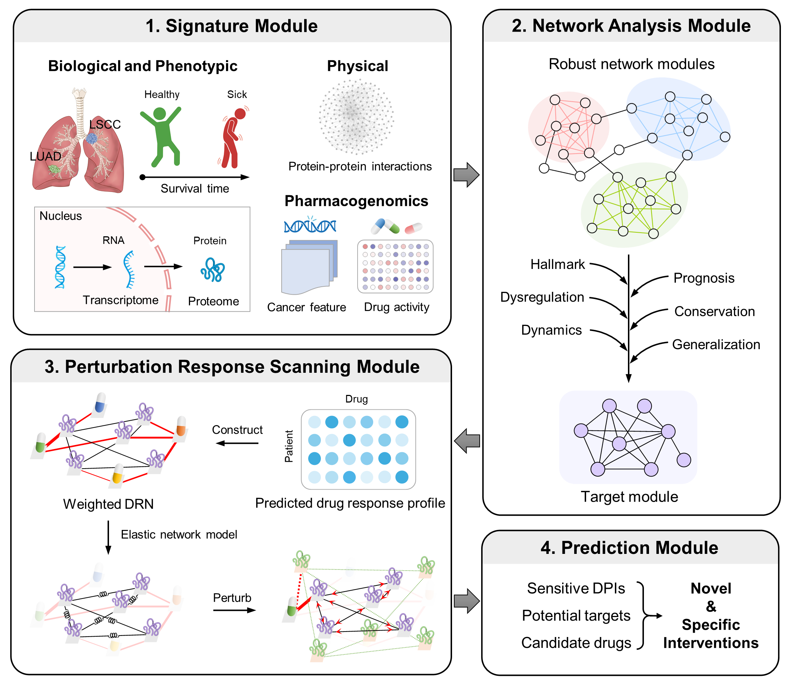

# SnpDR

## Framework


## How to use the script?
### Requirements
* R
* Anaconda3

These codes run in R, but some of their functions depend on a Python environment. Therefore, it is need to create a virtual environment named `pyUser` using anaconda3, with the Python version no lower than 3.7. Please open the Anaconda Prompt and enter the following command:
```
conda create -n pyUser python=3.9
conda activate pyUser
pip install rdkit
pip install descriptastorus 
pip install DeepPurpose
pip install seaborn
pip install goatools
pip install prody
conda deactivate
```
The Python environment is created to use the DeepPurpose tool and PRS analysis. For more details about DeepPurpose, please visit https://github.com/kexinhuang12345/DeepPurpose.

> **Note that the path to the pyUser environment should be obtained using `conda env list`. In subsequent analyses, this path will be used as a parameter in some functions.**

### Usage

#### Step0: Prepare
Download this repository to your local machine and extract it. Then, in R, set the working directory to the extracted folder and load the required packages:
```
setwd("this_file_path/SnpDR")
source("Rscript/0.Load_packages.R")
```

#### Step1: Signatrue Module
Preprocess the expression profile data.
```
source("Rscript/1.Signatrue.R")
expr_process(df_file="path/expression.txt")	#In the file:the rows represent proteins, and the columns represent samples.
```

#### Step2: Network Analysis Module
```
source("Rscript/2.Network_analysis.R")
```
##### Identify network modules
```
getModule(expr_file,group_file,node_cutoff=10)
```
* _expr_file_: The TXT file storing expression profile, with the following format:
  || sample1 | sample2 |... |
  | --- | --- | --- | --- |
  | protein1 | 2.345 | 6.480 | ... |
  | protein2 | 7.985 | 4.621  | ... |
  | ... | ... | ...  |...|

* _group_file_: The TXT file storing group information.
  |Sample| Group |
  | --- | --- |
  | sample1 | Tumor |
  | sample2 | Tumor |
  | sample3 | NAT |
  | ... | ... | 

* _node_cutoff_: The threshold for nodes in the module is set to 10 by default.

##### Annotate the functions of the modules
```
modl_Annot(node_file)
```
* _node_file_: The TXT file storing nodes of modules.
  |node| module |
  | --- | --- |
  | pro1 | M1 |
  | pro2 | M1 |
  | ... | ... |

##### GSEA of Hallmark genesets
```
Hallmark(node_file,FC_file)
```
* _node_file_: The TXT file storing nodes of modules.
  |node| module |
  | --- | --- |
  | pro1 | M1 |
  | pro2 | M1 |
  | ... | ... |

* _FC_file_: The TXT file storing log2(foldchange) of nodes.
  |node| log2FC |
  | --- | --- |
  | pro1 | 1.442 |
  | pro2 | 4.279 |
  | ... | ... |

##### Prognosis
```
Prognosis(node_file,expr_file,surv_file,hit_time=1000)
```
* _node_file_: The TXT file storing nodes of modules.
  |node| module | regulate |
  | --- | --- | --- |
  | pro1 | M1 | up |
  | pro2 | M1 | down |
  | ... | ... | ... |

* _expr_file_: The TXT file storing expression profile, with the same format as above.

* _surv_file_: The TXT file storing survival information.
  | Sample | Time | Status |
  | --- | --- | --- |
  | sample1 | 3540 | 1 |
  | sample2 | 582 | 0 |
  | ... | ... | ... |

* _hit_time_: Survival time, set to 1000 days by default.

##### Conservation
```
Preserve(Pdata,Tdata,Pmodule)
```
* _Pdata_: The TXT file storing Proteomic expression profile, with the same format as above.

* _Tdata_: The TXT file storing Transcriptomic sexpression profile, with the same format as above.

* _Pmodule_: The TXT file storing nodes of Proteomic modules.

```
Similarity(node_file1, node_file2)
```
* _node_file1_: The TXT file storing nodes of a set of modules.
* _node_file2_: The TXT file storing nodes of another set of modules.

##### Dynamics
```
Dynamics(edge_file,py_env)
```
* _edge_file_: The TXT file storing edge information of modules.
  |node1| node2 | module |
  | --- | --- | --- |
  | pro1 | pro2 | M1 |
  | pro2 | pro3 | M1 |
  | ... | ... | ... |

* _py_env_: The virtual environment path for pyUser installed using anaconda3, which can be obtained by running `conda env list` in `Anaconda Prompt`.


##### Generalization
```
Independence(node_file,expr_file1,expr_file2)
```
* _node_file_: The TXT file storing nodes for a specified module.
  |node|
  | --- |
  | pro1 |
  | pro2 |
  | ... |

* _expr_file1_: The TXT file storing Proteomic expression profile, with the same format as above.
* _expr_file2_: The TXT file storing the expression profile of another independent cohort, with the same format as above.

#### Step3: Perturbation Response Scanning Module
```
source("Rscript/3.PRS.R")
```
##### Construct a drug response network
```
getDRN(expr_file)
```
* _expr_file_: The TXT file storing expression profile of a specified module, with the following format:

##### Weight the drug response network
```
getAffinity(smiles_file,seq_file,DRN_file,py_env,pretrained_model='MPNN_CNN_BindingDB_IC50')
```
* _smiles_file_: The TXT file storing drug smiles.

  | drug | SMILES |
  | --- | --- |
  | drug1 |	C1=CC=C(C=C1)NC(=O)CCCCCCC(=O)NO |
  | drug2 |	C1=CC(=CC=C1/C=C\2/C(=O)NC(=N)S2)O |
  | drug3 | C1=C(C(=O)NC(=O)N1)F |
  | ... | ... |

* _seq_file_: The TXT file storing protein sequence. 

  | protein | Sequence |
  | --- | --- |
  | protein1 | MAADISESSGADCKGDPRNSAKLDADYPLR... |
  | protein2 | MPLAKDLLHPSPEEEKRKHKKKRLVQSPNS... |
  | protein3 | MPGPTPSGTNVGSSGRSPSKAVAARAAGST... |
  | ... | ... |
  
* _DRN_file_: The TXT file storing the predicted drug response network by `getDRN` function.
* _py_env_: The virtual environment path for pyUser installed using anaconda3, which can be obtained by running `conda env list` in `Anaconda Prompt`.
* _pretrained_model_: The DeepPurpose model type used, which defaults to 'MPNN_CNN_BindingDB_IC50'.

##### Calculat drug score
```
getPS(BA_file,PPIN_file,py_env)
```
* _BA_file_: The path to the binding affinity file (.txt) predicted by the `getAffinity` function.
* _PPIN_file_: The path to the PPI network file (.txt) . This file contains protein-protein interactions with columns named gene1 and gene2.
  |gene1| gene2 |
  | --- | --- |
  | pro1 | pro2 |
  | pro2 | pro3 |
  | ... | ... |
* _py_env_: The virtual environment path for pyUser installed using anaconda3, same as  `getAffinity`.

#### Step4: Prediction Module
```
source("Rscript/4.Prediction.R")

sensPredict(node_file,cell="LUSC")
```
* _node_file_: The TXT file storing nodes for a specified module.
  |node|
  | --- |
  | pro1 |
  | pro2 |
  | ... |
* _cell_: Cell line name, default is LUSC.
